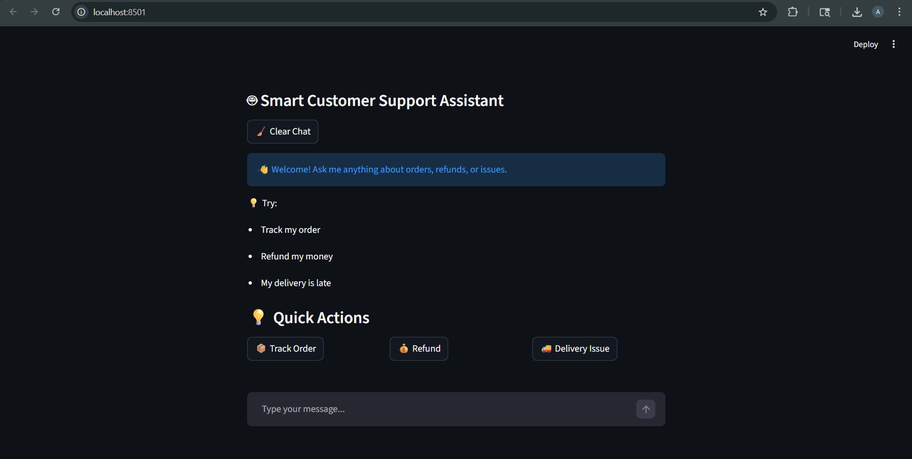

# 🤖 Self-Improving AI Customer Support Chatbot

## 🚀 Project Overview

This project focuses on building a **self-improving AI-powered customer support chatbot** that can understand user intent, detect emotions, and generate intelligent responses.
The system continuously improves by learning from failed conversations and adapting its behavior over time.

---

## 🧠 Key Features

* Intent detection using Machine Learning
* Emotion-aware response generation
* Confidence-based response handling
* Fallback mechanism for low-confidence predictions
* Failure detection and conversation logging
* Continuous learning from past interactions
* Analytics and insights generation

---

## 🏗️ Project Architecture

The project follows a modular design:

```bash
Customer-Chatbot/
│
├── Backend/        # Model training, prediction & logic
├── Frontend/       # Streamlit UI
├── Data/           # Datasets (intent, emotion, logs)
├── Docs/           # Weekly progress documentation
├── Diagrams/       # System architecture diagrams
├── app.py          # Main application
├── requirements.txt
└── README.md
```

---

## ⚙️ Technology Stack

* Python
* Streamlit
* FastAPI / Flask
* Scikit-learn
* SQLite

---

## ▶️ How to Run the Project

### 1. Clone the Repository

```bash
git clone https://github.com/Avneet-Chahal/Customer-Chatbot.git
cd Customer-Chatbot
```

### 2. Install Dependencies

```bash
pip install -r requirements.txt
```

### 3. Run the Application

```bash
streamlit run app.py
```

---

## 📊 Model Details

* Algorithm: Logistic Regression
* Text Processing: TF-IDF Vectorization
* Train-Test Split: 80-20
* Evaluation: Accuracy + Classification Report

---

## 📅 Development Progress

* **Week 1**: System design and architecture planning
* **Week 2**: Data collection and preprocessing
* **Week 3**: NLP model training (Intent Classification)
* **Week 4**: Chatbot logic and response system
* **Week 5+**: UI integration, improvement, and testing

---

## 📸 Demo (Add Screenshot Here)

```bash

```

---

## 🔮 Future Enhancements

* Integration with Deep Learning models (BERT / Transformers)
* Multi-language chatbot support
* Real-time database integration
* Cloud deployment (Streamlit Cloud / AWS)
* Advanced analytics dashboard

---

## 🌐 Live Demo
https://customer-chatbot-01.streamlit.app

---

## 👨‍💻 Author

**Avneet Kaur**

---

## ⭐ Support

If you like this project, consider giving it a star ⭐ on GitHub!
